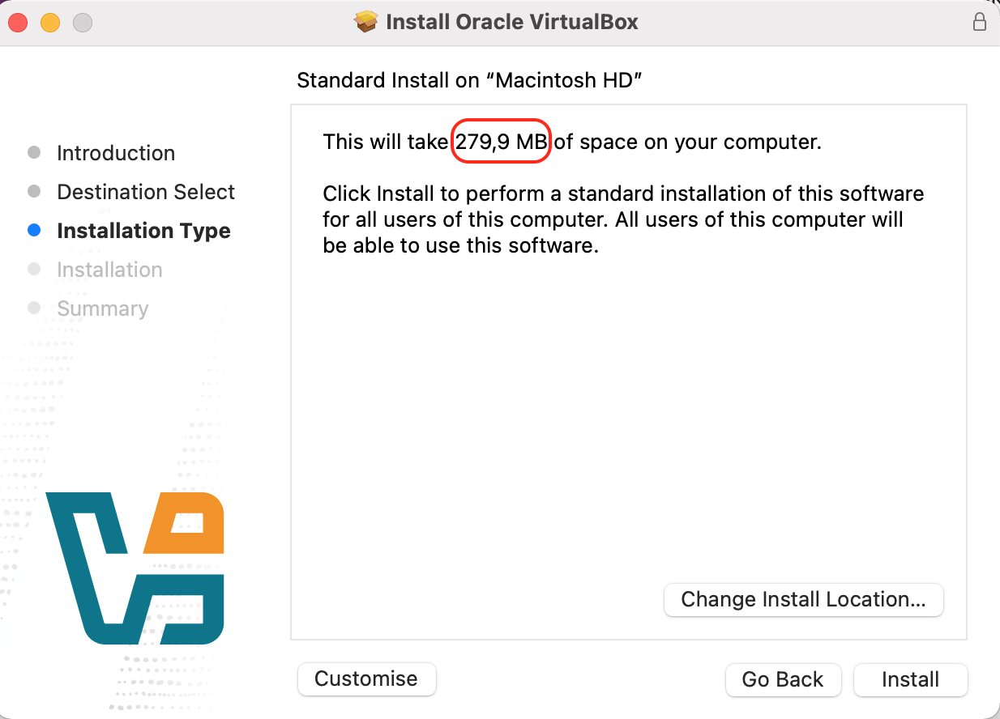
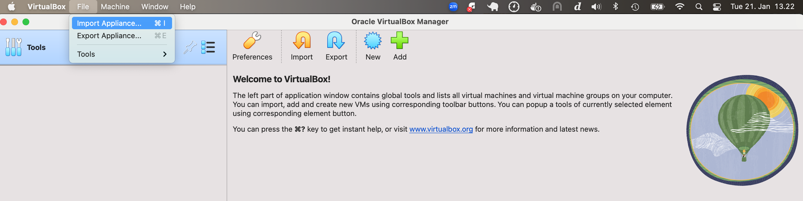
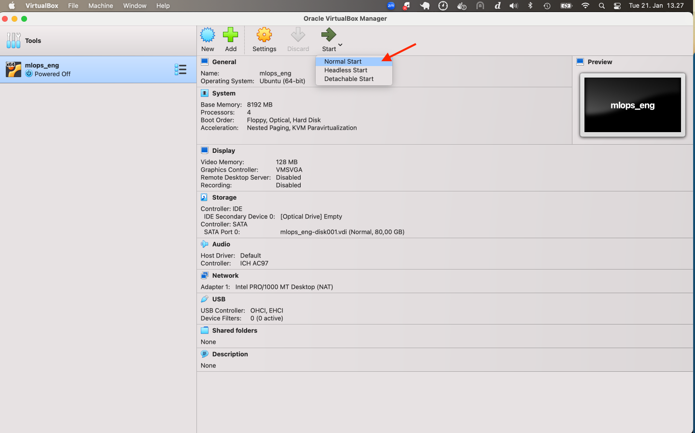
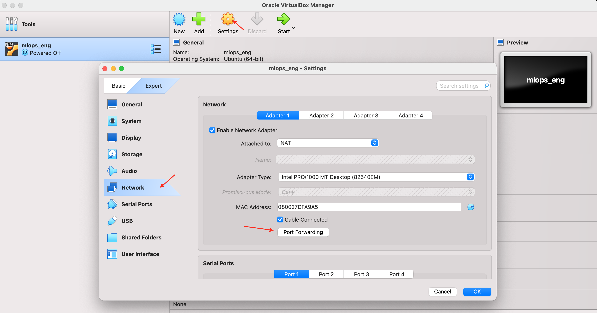
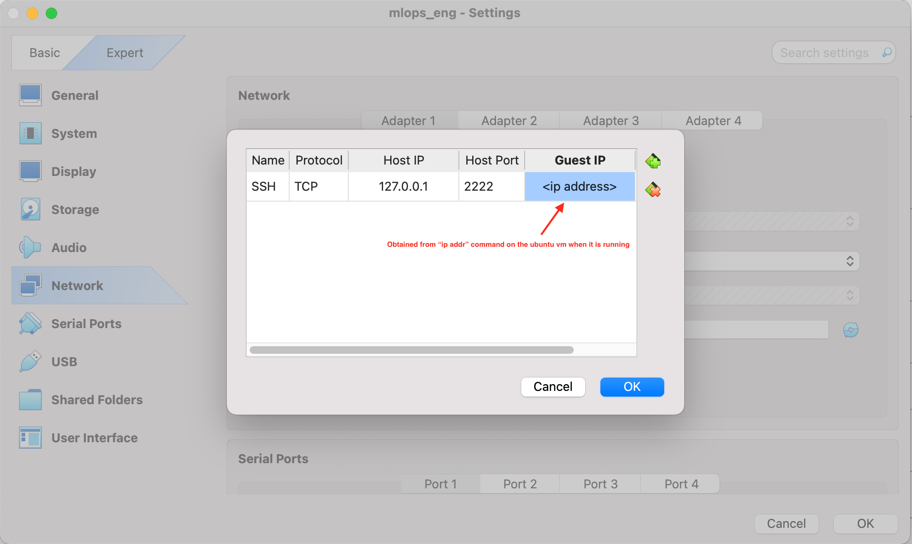

# Creating an Ubuntu Virtual Machine (VM) as the local environment

The course's programming environment is based on Ubuntu 22.04. To run
an Ubuntu local machine on a MacOs environment, we encourage using a
VM to run Ubuntu as a guest operating system.

We provide an Ubuntu Image (Ubuntu 22.04 LTS OVA file) which can be
imported into the VM.

### 1. Download and install virtualbox
#### 1) Download VirtualBox

VirtualBox can be downloaded from [the official website](https://www.virtualbox.org/wiki/Downloads). Version 7 is
recommended. Select the package relevant to your own machine Intel vs Apple Silicon package.



#### 2) Download the OVA file
The OVA file can be downloaded [here](https://helsinkifi-my.sharepoint.com/:u:/g/personal/luoyumo_ad_helsinki_fi/EZ3mHwXyGcdItbl0gx6MKZIB0N6yVXVTcLR5jlb7PWeuGA?e=2hcmNa).

#### 3) Import the OVA file in VirtualBox
1. Open VirtualBox
2. Click File -> Import Appliance



3. Select the downloaded OVA file, click Next -> Finish


### 2. Start the virtual machine
After importing the OVA file, you will see a VM created. 




Enable bidirectional shared clipboard so you can copy/paste text from your host to VM (and vice versa). You can do this by going to VirtualBox Toolbar -> clicking Devices -> Shared Clipboard -> selecting Bidirectional

You can also set Drag'n'Drop to bidirectional so you can drag and drop
files and directories from your host to VM and vice versa. However,
this functionality may not work in some MacOS variants. An alternative
solution for moving files between the host and guest OS would be using
ssh/scp. To setup ssh, setup port forwarding in the VM before starting
the guest machine.





If the ssh configuration has been done, you should be able to transfer files from MacOS host to the Ubuntu guest VM
```bash
scp -P 2222 /path_to_file/file.txt user@127.0.0.1:/home/user/
```

Incase your screen starts flickering after starting the mlops_eng vm,
adjust your virtual screen to a suitable resolution by trying
different configurations.

The settings can be found from the Toolbar -> View -> Virtual Screen 1

### 3. Log in to the virtual machine
Now, you can log in to your VM. The username is "**user**" and the password for admin privilege is "**password**". 

*Note*: the default keyboard layout of the VM is Finnish, you can
 configure the keyboard layouts from within the virtual machine (not
 virtualbox). Settings -> Keyboard -> Input Sources (Select the
 correct layout and add it). For more details follow [this
 article](https://help.ubuntu.com/stable/ubuntu-help/keyboard-layouts.html.en).

### 4. Download the course repository
---

In your VM, open a terminal (ctrl+alt+t) and run the following command to download the course repository:
```bash

git clone git@version.helsinki.fi:mlops/engineering_of_ml_systems.git #ssh

git clone https://version.helsinki.fi/mlops/engineering_of_ml_systems.git # https
# You will be asked to enter a username and password, these are your university credentials. 
```

Set up your conda env. 
```bash
# Under the same directory as this file
conda env create -f mlops_eng_environment.yaml # The YAML file located in the same directory as this doc

# Switch to the created conda environment
conda activate mlops_eng
```

And go to the `engineering_of_ml_systems/pre-materials` directory:
```bash
cd <path_to_engineering_of_ml_systems>/pre-materials
```
You can use Visual Studio Code (VS Code) to open the directory:
```bash
# Under the pre-materials repository
code .
```
Open the `README.md` and you'll see the same instructions. You can open a preview of a Markdown file by clicking the button shown below in the upper-right corner.


---

#### Backup course materials (Optional)
It's a good practice a back up the course materials you'll be working on so you won't loss them (especially your work-in-progress assignments) when your VM crashes. Note that your modifications on the files in your VM won't be synchronized to your host so you need to take care of the backup, e.g., using GitHub or some other cloud services like OneDrive or Google Drive. Alternatively, you can also back up the whole virtual machine by creating an OVA file for it, as shown in this [video](https://www.youtube.com/watch?v=9qSTS-RgOA0).

---

After finishing the preparation, continue with the "2. Create a VM in cPouta" section in the [main instructions](../README.md#2-create-a-vm-in-cpouta). 

